# Kessoku

[](https://pkg.go.dev/github.com/mazrean/kessoku)

**Kessoku is a compile-time dependency injection library for Go that speeds up application startup through parallel dependency injection.** Unlike traditional DI frameworks that initialize services sequentially, Kessoku automatically executes independent providers in parallel, dramatically reducing startup time for applications with multiple slow services. Built as a powerful alternative to google/wire, it generates optimized code at compile time with zero runtime overhead.

**Sequential:** DB → Cache → Auth = Total waiting time  
**Parallel:** DB + Cache + Auth = Fastest service wins

```go
// Before: Sequential (google/wire)
wire.Build(NewDB, NewCache, NewAuth, NewApp)     // Each waits for previous

// After: Parallel (Kessoku)  
kessoku.Inject[*App]("InitApp",
    kessoku.Async(kessoku.Provide(NewDB)),      // }
    kessoku.Async(kessoku.Provide(NewCache)),   // } All run together
    kessoku.Async(kessoku.Provide(NewAuth)),    // }
    kessoku.Provide(NewApp),                    // waits for all
)                                               // Fastest possible startup
```

**Result:** Every restart gets faster. Multiple slow services? Maximum impact.

## Why This Matters

**Your typical day:** Restart your app 10 times during development. Each restart wastes time waiting for services to start one by one.

```mermaid
gantt
    title Sequential vs Parallel Startup
    dateFormat X
    axisFormat %L
    
    section Sequential (slow)
    DB Service    :0, 3
    Cache Service :3, 5  
    Auth Service  :5, 6
    
    section Parallel (fast)
    DB Service    :0, 3
    Cache Service :0, 2
    Auth Service  :0, 1
```



**Perfect for:**
- **Cold start nightmares:** Your Lambda/serverless function times out during initialization
- **Dev restart hell:** You restart your app 10+ times daily, losing 3+ seconds each time  
- **Multi-DB apps:** PostgreSQL + Redis + S3 + Auth0 = 800ms+ sequential startup pain
- **google/wire refugees:** You love compile-time DI but hate slow startup times

## Quick Start

**Install kessoku:**

```bash
go get -tool github.com/mazrean/kessoku
```

**Create `main.go`:**
```go
package main

import (
    "fmt"
    "time"
    "github.com/mazrean/kessoku"
)

func SlowDB() string {
    time.Sleep(200 * time.Millisecond)
    return "DB-connected"
}

func SlowCache() string {
    time.Sleep(150 * time.Millisecond)
    return "Cache-ready"
}

//go:generate go tool kessoku $GOFILE

var _ = kessoku.Inject[string]("InitApp",
    kessoku.Async(kessoku.Provide(SlowDB)),
    kessoku.Async(kessoku.Provide(SlowCache)),
    kessoku.Provide(func(db, cache string) string {
        return fmt.Sprintf("App running with %s and %s", db, cache)
    }),
)

func main() {
    start := time.Now()
    result, _ := InitApp()
    fmt.Printf("%s in %v\n", result, time.Since(start))
}
```

**Run:**
```bash
go generate && go run main.go
# Shows: App running with DB-connected and Cache-ready (parallel startup)
```

## From google/wire

**2-minute upgrade:**
1. Replace `wire.Build(...)` → `kessoku.Inject[T]("FuncName", ...)`
2. Add `kessoku.Async()` around slow providers
3. Update `//go:generate` directive

**Result:** Same functionality, faster startup.

## API Cheat Sheet

**Full docs:** [pkg.go.dev/github.com/mazrean/kessoku](https://pkg.go.dev/github.com/mazrean/kessoku)

- **`kessoku.Async(provider)`** - Make this provider run in parallel
- **`kessoku.Provide(fn)`** - Regular provider (sequential)
- **`kessoku.Inject[T](name, ...)`** - Generate the injector function
- **`kessoku.Set(...)`** - Group providers for reuse
- **`kessoku.Value(val)`** - Inject constants
- **`kessoku.Bind[Interface](impl)`** - Interface → implementation

**Rule:** Independent async providers run in parallel, dependent ones wait automatically.

---

## vs Alternatives

| Tool | Best For | Startup Speed | Learning Curve |
|------|----------|---------------|----------------|
| **Kessoku** | Apps with slow services needing fast startup | Up to 1-5x faster[^1] | Easy (if you know wire) |
| **google/wire** | Simple apps, maximum stability | Baseline | Easy |
| **uber/fx** | Complex apps with lifecycles, hooks | Slowest (runtime) | Steep |

[^1]: Speed improvement depends on number of slow, independent services

**Choose Kessoku if:** You have multiple slow services (DB, cache, APIs) and startup time matters  
**Choose google/wire if:** You want maximum simplicity and startup speed isn't critical  
**Choose uber/fx if:** You need complex lifecycle management and don't mind runtime overhead

**Examples:** [examples/](./examples/) - basic, async_parallel, sets  
