# Kessoku

[](https://pkg.go.dev/github.com/mazrean/kessoku)

**Kessoku speeds up Go application startup through parallel dependency injection.**

```go
// Before: Sequential (google/wire)
wire.Build(NewDB, NewCache, NewAPI, NewApp)     // 450ms

// After: Parallel (Kessoku)  
kessoku.Inject[*App]("InitApp",
    kessoku.Async(kessoku.Provide(NewDB)),      // 200ms }
    kessoku.Async(kessoku.Provide(NewCache)),   // 150ms } concurrent
    kessoku.Async(kessoku.Provide(NewAPI)),     // 100ms }
    kessoku.Provide(NewApp),                    // waits for all
)                                               // 200ms total (2.25x faster in this example)
```

## Quick Start

**Try it yourself in 30 seconds:**

**1. Install:**
```bash
go get github.com/mazrean/kessoku
```

**2. Create demo file (main.go):**
```go
//go:generate go tool kessoku $GOFILE
package main
import ("context"; "fmt"; "time"; "github.com/mazrean/kessoku")

func connectDB() string { time.Sleep(200*time.Millisecond); return "DB" }
func initCache() string { time.Sleep(150*time.Millisecond); return "Cache" }  
func setupAuth() string { time.Sleep(100*time.Millisecond); return "Auth" }

var _ = kessoku.Inject[string]("InitApp",
    kessoku.Async(kessoku.Provide(connectDB)),   // runs in parallel
    kessoku.Async(kessoku.Provide(initCache)),   // runs in parallel
    kessoku.Async(kessoku.Provide(setupAuth)),   // runs in parallel
    kessoku.Provide(func(db, cache, auth string) string {
        return fmt.Sprintf("App: %s+%s+%s", db, cache, auth)
    }),
)

func main() {
    start := time.Now()
    app, _ := InitApp(context.Background())
    fmt.Printf("%s ready in %v\n", app, time.Since(start))
}
```

**3. Run and see the improvement:**
```bash
go generate && go run main.go
# Output: App: DB+Cache+Auth ready in ~200ms
# Without Kessoku: would be 450ms (sequential execution)
```

## How It Works

Kessoku identifies independent services and runs them in parallel instead of sequentially:

```mermaid
gantt
    title Sequential vs Parallel Execution
    dateFormat X
    axisFormat %Lms
    
    section Sequential (450ms)
    Database    :0, 200
    Cache       :200, 350  
    Auth        :350, 450
    
    section Parallel (200ms)
    Database    :0, 200
    Cache       :0, 150
    Auth        :0, 100
```



**Perfect for:**
- Multiple slow services (databases, APIs, external connections)  
- Performance-critical environments (microservices, serverless)
- Existing google/wire projects wanting speed improvements

## Migration from google/wire

**Already using google/wire?** Upgrade in 2 minutes:

```go
// Before
//go:generate wire
func InitApp() (*App, error) {
    wire.Build(NewDB, NewCache, NewApp)
    return &App{}, nil
}

// After  
//go:generate go tool kessoku $GOFILE
var _ = kessoku.Inject[*App]("InitApp",
    kessoku.Async(kessoku.Provide(NewDB)),    // now parallel
    kessoku.Async(kessoku.Provide(NewCache)), // now parallel
    kessoku.Provide(NewApp),
)
```

**Changes:** Replace `wire.Build()` → `kessoku.Inject[T]()`, add `kessoku.Async()` for slow providers

## API Reference

**Core functions:**
- **`kessoku.Inject[T](name, ...providers)`** - Declares an injector function
- **`kessoku.Async(provider)`** - Enables parallel execution  
- **`kessoku.Provide(fn)`** - Wraps a provider function
- **`kessoku.Set(...providers)`** - Groups providers for reuse
- **`kessoku.Bind[Interface](provider)`** - Interface binding
- **`kessoku.Value(val)`** - Constant value injection

**Dependency rules:** Independent providers run in parallel, dependent providers wait automatically.

---

## Advanced Usage

**Installation:** `go get github.com/mazrean/kessoku`

**vs Alternatives:**
- **Kessoku:** Parallel execution, 2.25x faster startup
- **google/wire:** Sequential only, simpler but slower  
- **uber/fx:** Runtime DI, complex lifecycles, reflection overhead

**Examples:** See [examples/](./examples/) - basic, async_parallel, sets

**Full docs:** [pkg.go.dev/github.com/mazrean/kessoku](https://pkg.go.dev/github.com/mazrean/kessoku)
